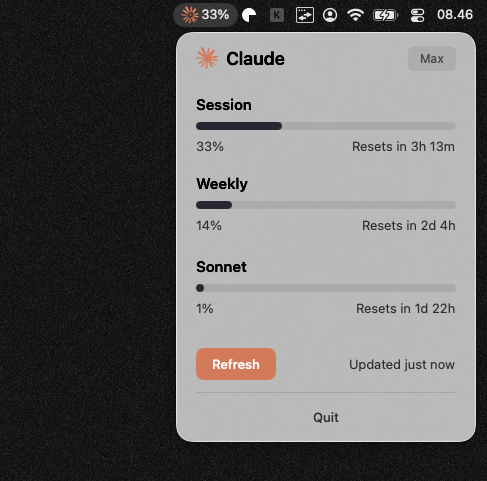

# Claude Usage

A native macOS menu bar app that displays your Claude API usage statistics.



## Features

- **Session usage** - 5-hour rolling window utilization
- **Weekly usage** - 7-day total utilization
- **Sonnet usage** - Sonnet-specific weekly utilization
- Auto-refresh every 60 seconds
- Uses existing Claude Code OAuth credentials (no API key needed)

## Requirements

- macOS 14.0+
- [Claude Code CLI](https://claude.ai/code) installed and logged in (`claude login`)

## Build

```bash
swift build
```

## Run

```bash
swift run
```

## Code Signing (Optional)

To avoid Keychain password prompts on every launch, sign the app with your developer certificate:

```bash
swift build
codesign --force --sign "Your Developer Identity" .build/debug/ClaudeUsage
```

Find your identity with:
```bash
security find-identity -v -p codesigning
```

## How It Works

The app reads OAuth credentials from the macOS Keychain (stored by Claude Code) and fetches usage data from Anthropic's OAuth usage endpoint.

## License

MIT
